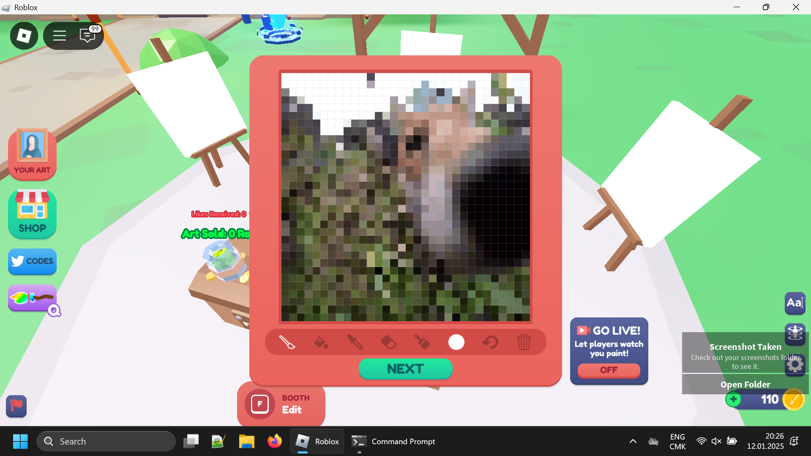

This is an automatic drawing tool for Roblox drawing games, like "Draw and Donate" or "Starving Artists". Follow the instruction below to use this program. Keep in mind that it's pretty slow and it is probably a good idea to leave this program to work overnight.

# An example of a finished painting in "Starving Artists"

# How to download this

* Go to https://github.com/megahomyak/autopainter/releases/latest and grab a zip from there
* Drag the folder inside of it onto your desktop
* Open the folder on the desktop

# How to set this up

* Install Python 3.13.0 from here: https://www.python.org/downloads/release/python-3130/ . The program may work with other versions of Python as well, it just wasn't tested on those versions
* If you mess up during the setup, just close its window and try again
* Run "setup.bat" (by double-clicking on it) and wait for all dependencies to install (you will see "Ready" in the window when it's over). If you see the cursor blink with no output, just wait more
* Switch to Roblox
* Make sure your canvas is open and your mouse cursor is not on the canvas
* Press the "r" key on your keyboard. Wait for about three seconds afterwards. It is important to give the program enough time to take a screenshot
* Click on the color picker button
* Click on the field for color code input (colors in that field look like "#1a2b3c")
* Click on the checkmark button in Draw and Donate or on the closing button in Starving Artists
* You're done! If button positions change in the future, run this script again

# How to use

* Drop any image into the folder with the scripts
* Set your canvas resolution to 200x200 and your brush size to 0 if you're in Draw and Donate. If you're in Starving Artists, check the setting change section below ("Changing some settings") to configure the program to draw in 32x32, and also set the brush size to "1" if not set already
* Run "run.bat"
* Switch to Roblox. The program will begin drawing as soon as it sees an empty canvas of the same size as in the setup. Don't forget that your mouse obstructs the canvas!
* Hold "q" for some time to stop the program
* Hold "p" for some time to pause the program, and after 10 seconds of pause you will be able to unpause the program by pressing "p" again (once)

# Changing some settings

There are some settings in `settings.txt` (the file that gets generated after the setup) that you can change.

* `"canvas_side_resolution"`: self-explanatory. Allows you to choose some other canvas resolution in the game, and the script will draw in the specified resolution
* `"colors_count"`: the amount of colors the resulting image will have. Can go up to 256. Color compression is important to have better performance on small canvas resolutions
